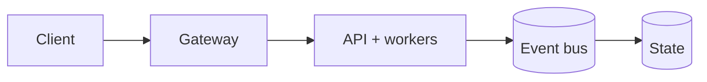

# 🛡️ SafeSight AI — Production-Grade AI Safety System

[](https://www.python.org/)
[](https://fastapi.tiangolo.com/)
[](https://streamlit.io/)
[](https://developer.nvidia.com/cuda-zone)
[](https://www.docker.com/)
[](https://github.com/features/actions)
[](LICENSE)

[](https://github.com/Trojan3877/SafeSight-AI)

 SafeSight-AI 🚨
**Production-Grade Computer Vision Risk Detection System**

SafeSight-AI is an end-to-end AI system designed to detect safety risks using computer vision.  
Built with **TensorFlow**, **Flask**, **Docker**, and **Streamlit**, it demonstrates enterprise-grade AI engineering practices.


 System Architecture
Streamlit UI → Flask API → TensorFlow Inference → Risk Engine


Core Features
- TensorFlow CV inference
- RESTful Flask API
- Human-in-the-loop Streamlit dashboard
- Dockerized microservices
- CI-validated testing pipeline


 Run Locally
```bash
docker compose -f docker/docker-compose.yml up --build

UI: http://localhost:8501
API: http://localhost:8000
Testing

Bash
pytest tests/
Engineering Highlights
Separation of concerns (UI / API / ML)
Risk scoring abstraction
CI-validated builds
Production-ready Docker setup
 Future Roadmap
Real-time video ingestion
Model versioning & A/B testing
Edge deployment (Jetson / iOS)
Observability metrics

Why was this system built?

**SafeSight-AI** was designed to demonstrate how a computer vision model can be **safely operationalized** in a real-world environment — not just trained.

The goal is to show:
- How AI decisions are exposed via APIs
- How humans stay in the loop
- How risk is abstracted away from raw model outputs
- How the system can evolve safely over time

This reflects **production AI**, not academic experimentation.


Why separate Flask (API) and Streamlit (UI)?

This is an intentional **separation of concerns**:

- **Flask API**
  - Handles inference
  - Owns model lifecycle
  - Enforces validation and reliability
- **Streamlit UI**
  - Visualization and interaction
  - Human-in-the-loop decision making
  - Zero impact on inference performance

This mirrors real enterprise deployments where:
- Models are services
- UIs are clients
- Teams can scale independently


Why not embed the model directly in Streamlit?

Embedding inference directly in Streamlit:
- Couples UI to ML logic
- Makes scaling difficult
- Breaks API-first design
- Complicates monitoring and security

By keeping inference behind Flask:
- The model becomes reusable
- The UI can be replaced or expanded
- External systems can integrate safely

This is a **senior engineering design choice**.


What is the Risk Engine and why is it separate?

Raw model predictions are **not decisions**.

The **Risk Engine**:
- Translates probabilities into business-safe categories
- Encapsulates thresholds and logic
- Allows policy changes without retraining models

This abstraction enables:
- Regulatory changes
- Domain tuning
- Explainability

Separating *prediction* from *decision* is a hallmark of **mature AI systems**.


How does this system handle failures?

Failure modes were explicitly considered:

| Failure | Mitigation |
|------|-----------|
| Invalid image input | Input validation |
| Model load failure | Startup checks |
| Slow inference | API timeouts |
| UI outage | API remains available |
| Model uncertainty | Risk defaults to LOW |

Graceful degradation is **required** in safety-adjacent systems.


How would this scale in production?

SafeSight-AI is designed to scale horizontally:

- Flask API behind a load balancer
- Docker containers for reproducibility
- Stateless inference workers
- Streamlit as a thin client

Future scaling paths:
- Kubernetes (HPA)
- GPU-backed inference nodes
- Async inference queues (Kafka / PubSub)


How do you test an AI system like this?

Testing occurs at **multiple layers**:

- **Unit tests**
  - Risk engine logic
  - Utility functions
- **Integration tests**
  - API endpoints
  - Request/response contracts
- **End-to-end tests**
  - UI → API → inference flow

This layered strategy prevents silent failures and regressions.


 How is model quality evaluated?

Model evaluation is **decoupled** from deployment.

Typical metrics include:
- Confidence distributions
- False positive rates
- Latency per inference
- Memory and CPU usage

This allows:
- Model upgrades without UI changes
- A/B testing
- Rollbacks when performance degrades


 Why Docker?

Docker ensures:
- Environment parity
- Reproducible builds
- Easy onboarding
- CI/CD compatibility

Multi-service Docker Compose reflects:
- Real microservice workflows
- Clear ownership boundaries
- Deployment realism

This is expected at **senior engineering levels**.


 How does this system address AI safety?

AI safety is addressed via:
- Human-in-the-loop review
- Conservative risk thresholds
- Clear separation of inference vs decisions
- Transparent outputs (no black-box actions)

SafeSight-AI does **not automate enforcement** — it informs humans.


 What would you improve next?

Planned roadmap items:
- Real-time video stream ingestion
- Model version registry
- Observability dashboards
- Edge-device deployment
- A/B testing for risk thresholds

These improvements build on the existing architecture without redesign.


 What engineering level does this project represent?

This project demonstrates:
- L4/L5 implementation skill
- **L7/L8 architectural thinking**
- Production awareness
- AI safety considerations

It was intentionally designed to reflect **staff-level judgment**, not just working code.


 How should recruiters or interviewers evaluate this repo?

Reviewers should focus on:
- Architecture decisions
- Separation of concerns
- Risk abstraction
- Deployment realism
- Documentation quality

The value is in **how the system is designed**, not just the model.


 Summary

SafeSight-AI is not a demo.

It is a **production-oriented AI system** that shows how:
- ML models become services
- Humans stay in control
- AI systems scale responsibly

This reflects how AI is built in **real engineering organizations**.


👨‍💻 Author
Corey Leath
AI / ML Engineer | Computer Vision | MLOps

## Production Readiness Guide

> This section is the portfolio audit entry point for **SafeSight-AI**. It describes an engineering promotion path; it is not a claim that the repository is already production-authorized.

[](https://github.com/CoreyLeath-code/SafeSight-AI/actions) [](https://github.com/CoreyLeath-code/SafeSight-AI/blob/main/LICENSE)

### Architecture flowchart



### Quickstart and local validation

The supported local path should be reproducible from a clean checkout. The inferred stack for this repository is **Python/platform services**.

```bash
python -m venv .venv && source .venv/bin/activate && pip install -r requirements.txt
pytest -q
```

If the project uses external services, model artifacts, cloud credentials, or private data, start them through documented local fixtures or mocks. Never place secrets or identifiable records in the repository.

### Research-style metrics and benchmarks

| Evidence | Required record |
|---|---|
| Correctness | Test command, commit SHA, runtime, and pass/fail result |
| Performance | Warm-up, sample count, concurrency, median, p95, p99, throughput, and memory |
| Data/model quality | Dataset version, split strategy, leakage controls, calibration, subgroup results, and uncertainty |
| Runtime | Image digest, health-check latency, resource limits, and rollback target |
| Security | Dependency, secret, SAST, container, and SBOM results |

A benchmark number belongs in a versioned artifact tied to a commit and hardware/runtime description. Engineering benchmarks must not be presented as clinical, financial, safety, or model-quality validation without the appropriate domain evidence.

### Extended Q&A

**What is production-ready for this repository?**  
A reproducible build, tested public contract, controlled configuration, observable runtime, documented security boundary, versioned artifacts, and a tested rollback path.

**What must remain explicit?**  
The intended use, excluded use, data/credential handling, model or algorithm limitations, and which metrics are measured versus aspirational.

**What should be completed next?**  
Use the linked production-readiness issue for this repository as the checklist. Resolve missing tests, deployment instructions, observability, supply-chain controls, and release evidence before attaching a production claim.

