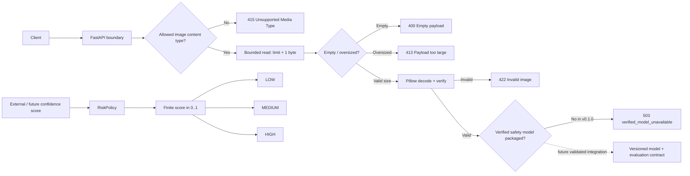
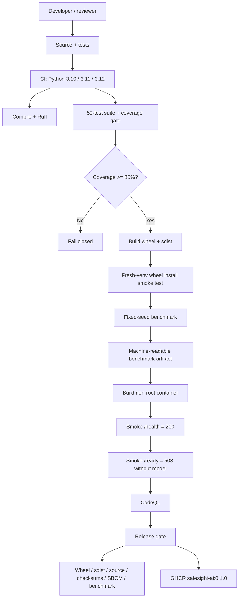

# SafeSight AI — Evidence-Bounded Safety Policy & Image Validation API

[](https://github.com/CoreyLeath-code/SafeSight-AI/actions/workflows/ci.yml?query=branch%3Amain)
[](https://github.com/CoreyLeath-code/SafeSight-AI/actions/workflows/codeql.yml?query=branch%3Amain)
[](https://github.com/CoreyLeath-code/SafeSight-AI/releases/latest)
[](pyproject.toml)
[](METRICS.md)
[](LICENSE)
[](https://github.com/CoreyLeath-code/SafeSight-AI/pkgs/container/safesight-ai)

SafeSight AI v0.1.0 is a **safety-adjacent software engineering reference implementation**, not a validated computer-vision safety product. The release-supported surface provides a FastAPI boundary for bounded image uploads, image decoding/validation, explicit liveness/readiness semantics, and a deterministic risk-policy module for already-produced confidence scores.

> **Evidence boundary:** v0.1.0 intentionally ships **without a reviewed safety model artifact or versioned evaluation dataset**. `/predict` therefore fails closed with HTTP `503` after a valid image is accepted and decoded. The repository does not claim validated CV accuracy, real-world safety effectiveness, GPU/CUDA inference, production capacity, or live LLM-backed risk analysis.

## What is implemented and verified

| Surface | v0.1.0 contract |
|---|---|
| API | FastAPI `/health`, `/ready`, and `/predict` endpoints |
| Upload safety | content-type allowlist, bounded read, empty/oversize rejection, decoded-image verification |
| Model readiness | explicit `503 verified_model_unavailable` because no verified model ships |
| Risk policy | validated finite `[0,1]` inputs, configurable medium/high thresholds, deterministic LOW/MEDIUM/HIGH mapping |
| Legacy detector | deterministic synthetic fixture only; threshold is validated and enforced; **not CV inference** |
| CI | Python 3.10/3.11/3.12, compile/lint, tests, 85% fail-closed coverage gate |
| Packaging | wheel + sdist build and fresh-environment wheel install smoke test |
| Container | non-root FastAPI image with health check and CI smoke tests |
| Security | CodeQL analysis |
| Reproducibility | fixed-seed policy benchmark with protocol, environment, latency distribution, throughput, memory, and JSON artifact |
| Release | Python distributions, source archive, benchmark JSON, SHA-256 checksums, CycloneDX SBOM, GitHub Release, GHCR image |

Validated CI run `33200052693` passed **50 tests on Python 3.10, 3.11, and 3.12**, measured **96.24% coverage** of the canonical `safesight` package, built/installed the wheel, generated benchmark evidence, built the container, verified `/health` returns 200 and `/ready` returns 503, and completed CodeQL successfully.

## Architecture flowchart



The image-validation path and risk-policy path are intentionally distinct. The policy can classify a confidence value, but v0.1.0 does not pretend that such a confidence value came from a verified model.

## System design flowchart



## Quick start

### Prerequisites

- Python 3.10–3.12
- Git
- Docker only for the container path

```bash
# Clone
git clone https://github.com/CoreyLeath-code/SafeSight-AI.git
cd SafeSight-AI

# Isolated environment
python -m venv .venv
source .venv/bin/activate        # Windows PowerShell: .venv\Scripts\Activate.ps1

# Canonical package + development tooling
python -m pip install --upgrade pip
python -m pip install -e ".[dev]"

# Run the same correctness gates used by CI
python -m pytest tests -v \
  --cov=safesight \
  --cov-report=term-missing \
  --cov-fail-under=85
ruff check safesight tests/test_release_*.py src/detector.py api/main.py app/app/app/core/risk_engine.py

# Start the supported API
uvicorn safesight.api:app --host 127.0.0.1 --port 8000
```

In another terminal:

```bash
curl -i http://127.0.0.1:8000/health
curl -i http://127.0.0.1:8000/ready
```

Expected semantics:

- `/health` → HTTP 200: the process is alive.
- `/ready` → HTTP 503: no verified safety model is packaged.
- `/predict` with a valid image → HTTP 503 after request/image validation, rather than a fabricated classification.

### Docker

```bash
docker build -t safesight-ai:local .
docker run --rm -p 8000:8000 safesight-ai:local
```

After v0.1.0 is published:

```bash
docker pull ghcr.io/coreyleath-code/safesight-ai:0.1.0
docker run --rm -p 8000:8000 ghcr.io/coreyleath-code/safesight-ai:0.1.0
```

### One-command evidence reproduction

```bash
make reproduce
```

This runs compile/lint, tests + coverage gate, Python package build, and the fixed benchmark protocol.

## Reproducibility contract

SafeSight separates deterministic software evidence from model-quality evidence.

### Correctness protocol

CI runs on Python `3.10`, `3.11`, and `3.12`. Each interpreter must install the canonical package, compile the relevant Python paths, pass Ruff, and run the test suite with an **85% minimum coverage threshold**. Failure of any matrix member blocks the package/container job.

The verified Python 3.11 run produced:

- 50/50 tests passed;
- 186 canonical package statements measured;
- 7 statements missed;
- 96.24% total `safesight` coverage;
- 85% fail-closed minimum.

### Benchmark protocol

The benchmark asks one narrow engineering question:

> On a documented CI runner, how long does the deterministic `RiskPolicy` take to classify the same fixed set of synthetic confidence values?

Fixed protocol:

- seed: `20260828`;
- confidence values per iteration: `10,000`;
- warm-ups: `5`;
- measured iterations: `50`;
- total measured classifications: `500,000`;
- medium threshold: `0.60`;
- high threshold: `0.85`;
- timer: `time.perf_counter_ns()`;
- memory: Python `tracemalloc` peak;
- machine-readable source of record: [`benchmarks/latest.json`](benchmarks/latest.json);
- reference CI run: [`33200052693`](https://github.com/CoreyLeath-code/SafeSight-AI/actions/runs/33200052693).

The benchmark excludes image decoding, model inference, HTTP/network overhead, concurrent clients, GPU/accelerator behavior, external services, and real-world safety/model quality.

## Research-style benchmarks and metrics

| Measurement | Verified reference value |
|---|---:|
| Tests | 50/50 passed |
| Python matrix | 3.10 / 3.11 / 3.12 passed |
| Canonical package coverage | 96.24% |
| Coverage gate | 85% fail-closed |
| Median / 10,000 policy classifications | 37.725465 ms |
| p95 / 10,000 policy classifications | 38.247523 ms |
| p99 / 10,000 policy classifications | 38.320200 ms |
| Derived classifications / second | 264,728.683 |
| Peak traced Python memory | 0.002338 MiB |
| Seeded LOW count | 6,025 |
| Seeded MEDIUM count | 2,441 |
| Seeded HIGH count | 1,534 |

Reference environment: Python `3.11.16`, `Linux-6.17.0-1022-azure-x86_64-with-glibc2.39`, package `0.1.0`; benchmark provenance is embedded in the JSON artifact.

These timings are development measurements, **not SLAs**. The seeded class counts verify deterministic threshold behavior only; they do not prove that the thresholds are optimal or safe for any deployment.

See [`METRICS.md`](METRICS.md) for the evidence table and model-quality gap analysis.

## Model-quality status

The previous repository documentation contained accuracy, precision, recall, F1, inference latency, throughput, CUDA, model-size, and GPU claims that were not tied to a reviewed model artifact, dataset protocol, or reproducible evaluation path. Those values are not part of the v0.1.0 evidence contract.

For a future model-backed release, the minimum evidence should include:

1. immutable model artifact + SHA-256 digest;
2. dataset provenance and license;
3. versioned evaluation fixture/dataset;
4. explicit train/validation/test or external-evaluation protocol;
5. leakage controls;
6. per-class precision/recall/F1 and confusion matrix;
7. calibration and threshold-selection evidence;
8. scenario/subgroup error analysis where appropriate;
9. representative image-inference latency/throughput with hardware and batch/concurrency settings;
10. intended-use, excluded-use, and human-review boundaries.

Until that evidence exists, model quality is **TBD**, not inferred from architecture or placeholder numbers.

## Failure and safety semantics

| Condition | Behavior |
|---|---|
| Process alive | `/health` returns 200 |
| No verified model | `/ready` returns 503 |
| Unsupported media type | `/predict` returns 415 |
| Empty upload | `/predict` returns 400 |
| Upload exceeds configured byte limit | `/predict` returns 413 |
| Claimed image cannot be decoded | `/predict` returns 422 |
| Valid image but no verified model | `/predict` returns 503 |
| Invalid risk-policy confidence/threshold | raises `ValueError`; no silent coercion |

A healthy process is not treated as a model-ready service. That distinction is intentional and container-tested.

## Release and package contract

v0.1.0 is published only after the release commit reruns compilation, lint, tests, the 85% coverage gate, Python distribution build, and the fixed benchmark. The workflow then creates:

- `safesight_ai-0.1.0-py3-none-any.whl`;
- `safesight_ai-0.1.0.tar.gz`;
- deterministic Git source archive;
- `benchmark-results.json`;
- `SHA256SUMS`;
- `sbom.cdx.json` CycloneDX SBOM;
- GitHub Release `v0.1.0`;
- `ghcr.io/coreyleath-code/safesight-ai:0.1.0`;
- `ghcr.io/coreyleath-code/safesight-ai:latest`.

The release workflow pulls and smoke-tests the published GHCR image before creating the immutable version tag/release.

## L6 audit findings addressed

The hardening pass prioritizes correctness and claim integrity over impressive wording. It:

- replaces “production-grade CV system” claims with an evidence-bounded release contract;
- removes unsupported model-quality/CUDA/throughput claims from release documentation;
- establishes one canonical `safesight` package instead of treating legacy folders as equally supported;
- keeps `api.main:app` as a compatibility shim while making `safesight.api:app` canonical;
- separates liveness from model readiness;
- bounds upload reads before accepting arbitrarily large request bodies;
- verifies image bytes rather than trusting filename/content type alone;
- preserves fail-closed `503` behavior when no model exists;
- validates confidence values and policy thresholds for finite `[0,1]` domains;
- makes the legacy detector’s synthetic nature explicit and makes its threshold actually functional;
- removes an accidental Flask dependency from canonical risk-policy testing;
- upgrades CI from one Python version / basic pytest to a fail-closed 3-version evidence pipeline;
- adds real package, benchmark, container, CodeQL, SBOM, checksum, release, and GHCR gates.

## Extended Q&A

### Is SafeSight v0.1.0 a production safety system?

No. It is a portfolio/reference implementation demonstrating safer software boundaries around a future model-backed service. It is not production-authorized and is not evidence that injuries, hazards, PPE violations, or other safety events can be detected reliably.

### Does SafeSight v0.1.0 perform computer-vision inference?

No verified model is packaged. Valid images are decoded and validated, then the API returns HTTP 503. This is intentional: returning a plausible-looking LOW/HIGH prediction without a verified artifact would be less safe and less honest.

### Why does `/health` return 200 while `/ready` returns 503?

They answer different questions. `/health` means the web process can respond. `/ready` means the service has the required inference capability for its intended model-backed role. Because v0.1.0 lacks that model, readiness fails closed.

### What does `RiskPolicy` actually do?

It maps an already-produced confidence score into LOW, MEDIUM, or HIGH using validated thresholds. Defaults are MEDIUM at `0.60` and HIGH at `0.85`. It rejects NaN, infinity, values outside `[0,1]`, empty prediction rows, and invalid threshold ordering.

### Is the risk policy proof that those thresholds are safe?

No. The tests prove deterministic software behavior at the chosen boundaries. They do not establish optimal decision thresholds for a real safety domain. Threshold selection would require representative labeled data, calibration/error-cost analysis, and domain review.

### Is `src/detector.py` a computer-vision detector?

No. It is now explicitly documented as a deterministic synthetic-event fixture used to exercise downstream logic. Its configured threshold is validated and applied, but its events are hard-coded test/demo data.

### What happened to TensorFlow/PyTorch/CUDA claims?

They are outside the v0.1.0 supported surface. A repository can contain experiments or old code without proving that a particular framework, GPU path, or model is part of a validated release. v0.1.0 claims only what CI and the release artifacts exercise.

### Does this release use Llama 3 or another LLM?

No. A legacy experimental file references a Llama model and optional transformer dependencies, but that path is not installed, executed, or validated by the v0.1.0 release. It is not part of the supported package contract.

### Why benchmark the risk policy instead of inference?

Because the risk policy is executable and deterministic while verified inference is unavailable. Benchmarking a nonexistent model path would produce fictional evidence. The policy benchmark is narrow, reproducible, and explicitly labeled as such.

### Are 264k classifications/second the API throughput?

No. That number is derived from an in-process Python policy microbenchmark over seeded floats. It excludes HTTP, image handling, model inference, concurrency, and network I/O. It must not be quoted as request throughput or safety-detection throughput.

### What does 96.24% coverage mean?

It means the validated CI run executed 179 of 186 measured statements in the canonical `safesight` package according to `coverage.py`. Coverage is not proof of correctness, security, or model quality; it is one test-evidence signal enforced with an 85% minimum gate.

### Why keep compatibility/legacy directories?

They preserve earlier experiments and import paths while the supported surface is normalized. Presence in the repository is not equivalent to release support. The `safesight/` package and documented workflows define the v0.1.0 contract.

### How are oversized uploads handled?

The API reads at most the configured limit plus one byte. If that extra byte exists, it returns 413. This avoids the previous pattern of reading the entire request body before checking its size.

### Can content type alone prove a file is an image?

No. The API first checks an allowlisted media type, then uses Pillow to decode/verify the actual bytes. Spoofed `image/jpeg` content that cannot be decoded receives 422.

### What is in the Python package?

The supported package contains the FastAPI application, deterministic risk policy, image validation, and benchmark harness. The wheel is built and installed into a fresh virtual environment in CI before the container stage.

### What is in the container package?

The GHCR image runs the canonical FastAPI service as a non-root user. CI verifies process liveness and the expected fail-closed readiness behavior. It does not contain a verified CV model in v0.1.0.

### What evidence should a reviewer inspect first?

Start with `safesight/api.py`, `safesight/policy.py`, `tests/`, `.github/workflows/ci.yml`, `.github/workflows/release.yml`, `benchmarks/latest.json`, and `METRICS.md`. Those define the supported behavior and claim boundaries more accurately than legacy experiments.

### What should be built next?

The highest-value next step is not adding more architecture buzzwords. It is introducing a versioned, licensed evaluation dataset and a reviewed immutable model artifact, then building a reproducible evaluation harness with calibration/error analysis. After that, measure representative image-inference and API behavior separately, including concurrency, resource saturation, and failure scenarios.

## Engineering roadmap

- **v0.1.x:** strengthen property/invariant tests, tighten dependency/release provenance, and remove or quarantine more stale legacy paths.
- **v0.2:** add a hashed fixture dataset and model-artifact loading contract without claiming quality until evaluation is reproducible.
- **v0.3:** add model evaluation, calibration, per-class error analysis, representative inference benchmarks, and explicit model-card evidence.
- **Later:** add observability, concurrency/load testing, authenticated deployment boundaries, rollback exercises, and deployment-specific SLOs only after those paths are measured end-to-end.

## License

MIT. See [`LICENSE`](LICENSE).
